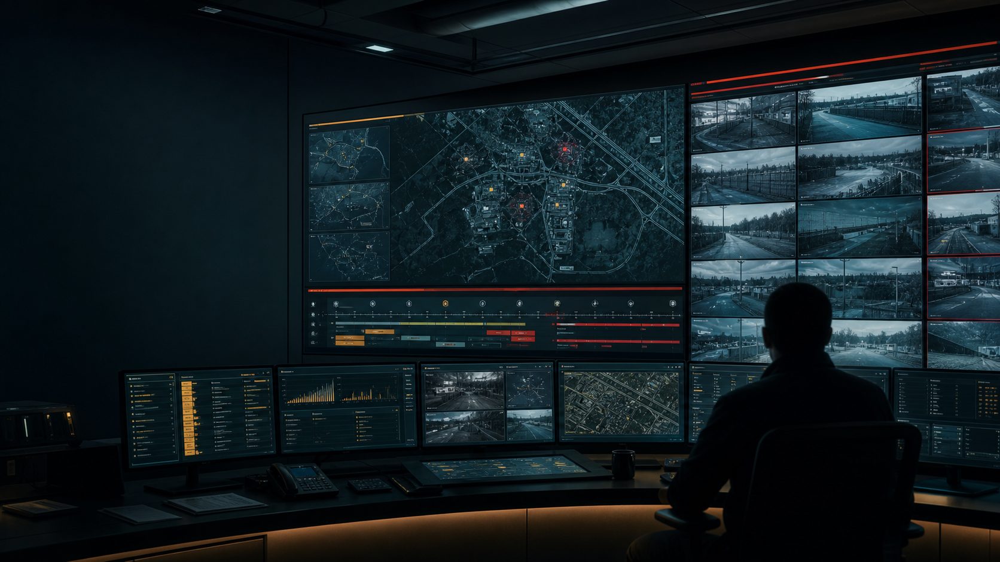
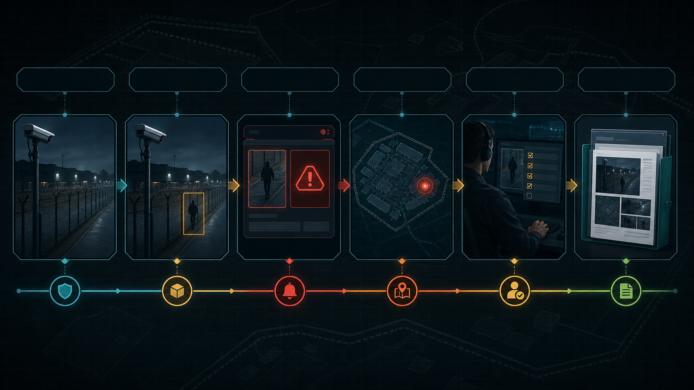
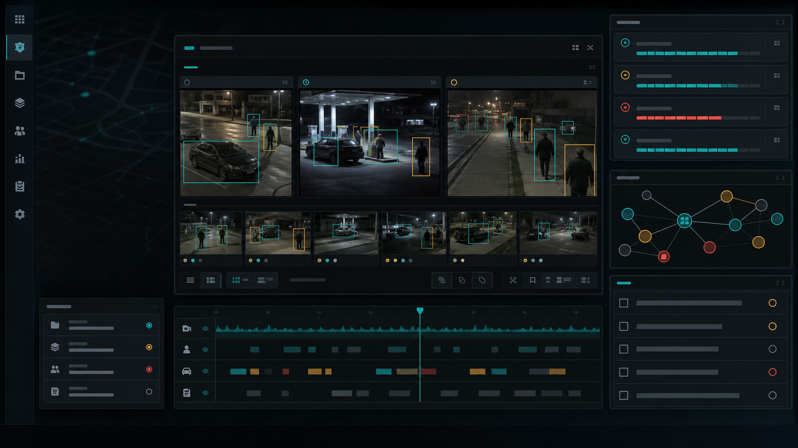
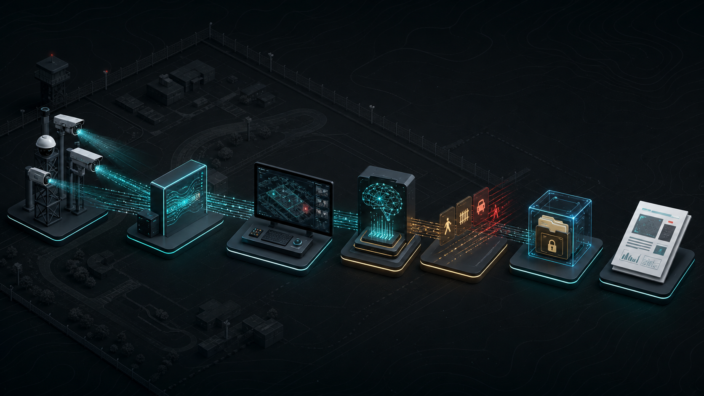

# Fusion Intel Copilot (D4D)

> 다중 CCTV, AI 객체 탐지, 실시간 알림, 증거 타임라인, LLM 기반 상황 판단 보조를
> 하나의 지휘통제(COP) 대시보드로 묶은 경계 감시 상황 인식 시스템입니다.

이 프로젝트는 "영상을 보는 화면"이 아니라, 여러 센서 이벤트를 **증거로 만들고**
사람이 검토할 수 있는 **대응 절차와 보고서**로 연결하는 운영형 COP(Common
Operational Picture)입니다. 최종 대응 판단은 항상 Response Gate를 통해
**사람이 직접 확인**하며, 실제 군사 데이터·신원 인식·표적 지정·자동 무력 행사를
암시하지 않습니다. 카메라 소스와 이벤트는 모두 **합성(CARLA 시뮬레이션) 데이터**를
사용합니다.



## 핵심 기능

- **시설 지도 (Facility Map)** — 2D/3D 지도, CCTV 노드, 커버리지 콘, 이벤트
  마커, 기상/지형 레이어
- **CCTV 월 (CCTV Wall)** — CARLA 카메라 레지스트리 기반 다중 카메라 실시간 타일
- **DETR 객체 탐지** — 서버 `/detect` 계약과 클라이언트 정규화, 온디바이스
  fallback 탐지 흐름
- **실시간 알림 (Realtime Alerts)** — 중복 탐지 병합, auto-close, 상관관계 알림
- **증거 타임라인 (Evidence Timeline)** — evidence clip, 선택 사건, citation 연결
- **AI 판단 보조 (Codex Agent)** — 사건 요약, 권고 조치, 확인 지점 생성 (요청
  캐시·timeout·응답 스키마 검증 포함)
- **활동 스트림 (Activity Stream)** — `/api/activity-stream` SSE 기반 백엔드
  이벤트 로그
- **응답 확인 게이트 (Response Confirmation)** — 티어별 대응 조치 카탈로그와
  인간 확인 절차
- **보고서/운영 지표** — daily report, connected nodes, confidence, coverage
  uptime 등 지표 패널

## 스크린샷

| Scenario Timeline | Evidence Packet |
| --- | --- |
|  |  |

## 시스템 흐름

1. CARLA 시뮬레이션 카메라가 CCTV 프레임을 생성합니다.
2. 카메라 브리지가 `/api/carla-cameras/:id/frame`로 최신 프레임을 제공합니다.
3. DETR inference 서비스가 프레임에서 객체와 bounding box를 추출합니다.
4. 대시보드가 탐지 결과를 evidence clip과 realtime alert로 변환합니다.
5. Telemetry 레이어가 사건, 마커, 타임라인, citation, response gate를 계산합니다.
6. Codex agent가 선택된 사건의 요약, 권고 조치, 확인 지점을 생성합니다.



## 기술 스택

- **Frontend**: React 19, Vite, TypeScript, `src/cop/*` COP 대시보드 컴포넌트
- **Backend**: Vite 플러그인 기반 서버 (`server/*`) — Codex agent, vision
  pipeline, CARLA 카메라 레지스트리, WebRTC 시그널링, 활동 스트림(SSE)
- **시뮬레이션**: CARLA (`sim/`) — 합성 CCTV 피드와 시나리오 액터
- **온톨로지/도메인 모델**: `src/ontology`, `src/domain`, `src/semantic`
- **테스트**: Vitest(단위), Playwright(E2E)
- **린트/포맷**: Biome

## 시작하기

### 요구 사항

- Node.js (npm 사용)
- (실시간 카메라 데모용) CARLA 시뮬레이터가 떠 있는 GPU 서버 — 자세한 절차는
  [`docs/demo-runbook.md`](docs/demo-runbook.md) 참고

### 설치

```bash
npm install
```

### 환경 변수

`.env.local`에 DETR 탐지 서버 주소를 지정합니다.

```
VITE_DETR_SERVER_URL=http://<gpu-server-ip>:8766
```

### 개발 서버 실행

```bash
npm run dev
```

CARLA 브리지 등 외부 기기에서 접근해야 하는 경우:

```bash
npm run dev -- --host 0.0.0.0
```

### 빌드 / 미리보기

```bash
npm run build
npm run preview
```

## 스크립트

| 명령 | 설명 |
| --- | --- |
| `npm run dev` | Vite 개발 서버 실행 |
| `npm run build` | 타입체크 후 프로덕션 빌드 |
| `npm run preview` | 빌드 결과 미리보기 |
| `npm run typecheck` | TypeScript 타입 검사 |
| `npm run lint` | Biome 린트 검사 |
| `npm run test` | Vitest 단위 테스트 |
| `npm run test:e2e` | Playwright E2E 테스트 |
| `npm run demo:cv` | 합성 픽스처 기반 CV 리포트 데모 |
| `npm run demo:ledger` | 합성 픽스처 기반 이벤트 원장(ledger) 데모 |
| `npm run demo:ontology` | 온톨로지 그래프 데모 |
| `npm run demo:agents` | 에이전트 시나리오 데모 |
| `npm run demo:semantics` | AI Hub 라벨 시맨틱 데모 |
| `npm run demo:reset` | 데모 상태 초기화 |
| `npm run qa:final` | typecheck + lint + test + build 전체 검증 |

## 프로젝트 구조

```
src/
  cop/        # COP 대시보드 UI (지도, CCTV 월, 알림, 타임라인, 리포트 등)
  domain/     # 도메인 모델 (이벤트, 트랙, 시나리오, 에이전트 등)
  ontology/   # 온톨로지 계약 및 어댑터 (Foundry 스타일 관계 그래프 포함)
  semantic/   # AI Hub 라벨 시맨틱 매핑
  cli/        # 데모 스크립트용 CLI 리포트 빌더
  fixtures/   # 합성 데이터 픽스처
  shared/     # 공용 유틸리티
  ui/         # 공용 UI 프리미티브
server/       # Vite 통합 백엔드 (Codex agent, vision pipeline, CARLA 연동 등)
sim/          # CARLA 브리지 및 시나리오 설정
docs/         # 설계, 런북, 리서치, 발표 자료
```

더 자세한 디자인 시스템/레이아웃 규칙은 [`DESIGN.md`](DESIGN.md),
현장 시연 절차는 [`docs/demo-runbook.md`](docs/demo-runbook.md)를 참고하세요.

## 안전 원칙

- 카메라 영상과 이벤트는 모두 합성/시뮬레이션 데이터입니다.
- 신원 인식, 생체 매칭, 표적 지정, 자동 무력 행사를 암시하는 UI/기능을 추가하지
  않습니다.
- 시스템은 불확실성을 드러내고 사람의 검토를 요청할 뿐이며, 모든 대응 결정의
  최종 권한은 운영자(사람)에게 있습니다.
